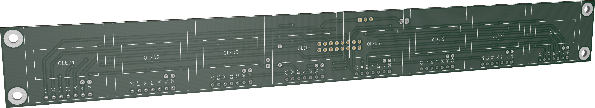
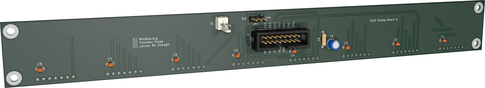

# Midibox PCBs

A collection of schematics and printed circuit board layouts for various [Midibox NG](http://www.ucapps.de/midibox_ng.html) modules,
made with [KiCAD](https://kicad.org/).
The designs were made with MCU style MIDI control surfaces in mind, but could also be useful for other applications.

## OLED carrier board

Holds eight 0.96″ OLED screens, spaced by 1.2″ for a compact design.

Only 4-wire SPI, 7-pin OLED types are supported.
Be sure to check the dimensions and pinout matches before purchase!

Optional decoupling 100nF caps `C1`-`C8` can be stuffed to improve noise rejection in case of flickering or other issues.

### Bill of materials

- OLED screen x 8
- 10k 1/4W resistor
- 10µF/35V radial capacitor
- 2x8 box connector socket
- 2x8 box headers x 2
- 16-way cable
- 7-pin sockets x 8 (0.1″ spacing, for the OLEDs)
- 3-pin header
- 2-pin jumper
- 100nF ceramic capacitor x 8 (optional)

### Assembly

1. Solder the sockets for the OLEDs on the top side
2. Solder all other components on the bottom side
3. Connect `J2` to `core/J15A` using a ribbon cable
4. Configure the software

### Connections

`J1` connects to `J15A` of the [STM32F4 core](http://www.ucapps.de/mbhp_core_stm32f4.html).

#### Internal power

`J15_S` should be set to 3.3V on the core, and `JP1` to _Core_ on this PCB.

#### External power

The LDO regulator on the core board can only supply 100mA.
Therefore this PCB has an option to use external 3.3V power through `J2`.
In this case `JP1` should be set to _Ext_.

----

----

----

## TODO

- Software configuration
- Secure OLED mechanically
- Photos of PCB and working displays
